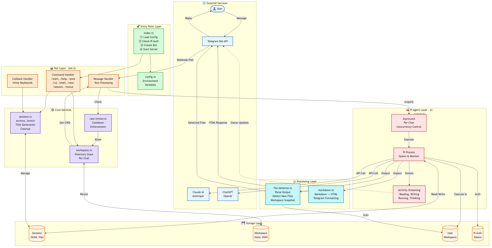
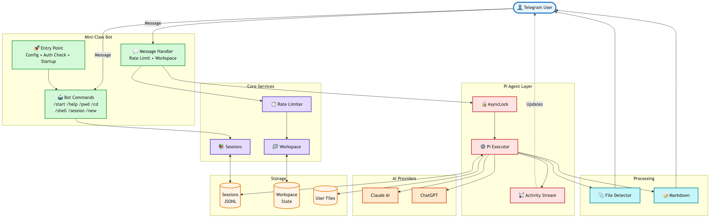
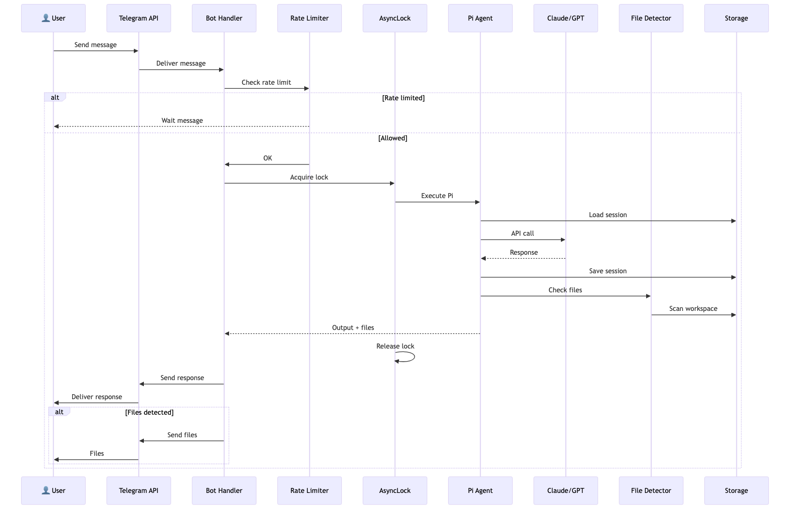

# Mini-Claw Documentation

## Architecture Documentation

This directory contains comprehensive architecture documentation for Mini-Claw, a lightweight Telegram bot for persistent AI conversations using the Pi coding agent.

## Documents

### 📄 [ARCHITECTURE.md](./ARCHITECTURE.md)
**Complete architecture documentation** with detailed explanations of:
- System layers and components
- Data flow and message processing
- Session persistence and management
- Concurrency and performance characteristics
- Configuration and deployment options
- Security considerations
- Testing strategy

**Includes:**
- Full component diagram with all modules
- Message flow sequence
- Detailed text explanations
- Configuration examples
- Troubleshooting guide

### 📄 [architecture-simple.md](./architecture-simple.md)
**Simplified diagrams** optimized for presentations and quick reference:
- System architecture overview
- Message flow sequence diagram
- Component interaction diagram

These diagrams use simpler layouts and are ideal for:
- Presentations and slides
- Quick onboarding
- High-level discussions

## Visual Diagrams (PNG)

All diagrams are available as high-resolution PNG files in the [diagrams/](./diagrams/) directory:

### 1. Full Architecture Diagram


**File**: `diagrams/full-architecture.png`

Shows the complete system with all layers:
- 🌐 External Services (User, Telegram, AI Providers)
- 🚀 Entry Point Layer (Config, Initialization)
- 🤖 Bot Layer (Commands, Message Handler, Callbacks)
- ⚙️ Core Services (Rate Limiter, Workspace, Sessions)
- 🧠 Pi Agent Layer (AsyncLock, Executor, Activity Streaming)
- 📝 Processing Layer (File Detector, Markdown Renderer)
- 💾 Storage Layer (Session Files, Workspace State, User Files)

### 2. System Overview


**File**: `diagrams/system-overview.png`

Simplified high-level view showing:
- Main components grouped by function
- Primary data flows
- Service interactions
- Storage systems

### 3. Message Flow Sequence


**File**: `diagrams/message-flow.png`

Step-by-step sequence diagram showing:
1. User sends message via Telegram
2. Rate limiting check
3. AsyncLock acquisition
4. Pi agent execution
5. AI provider interaction
6. File detection
7. Response delivery

## Quick Start Guide

### Understanding the Architecture

1. **Start with**: [System Overview](./diagrams/system-overview.png) - Get the big picture
2. **Deep dive**: [ARCHITECTURE.md](./ARCHITECTURE.md) - Read detailed explanations
3. **Flow analysis**: [Message Flow](./diagrams/message-flow.png) - Understand request processing

### Key Concepts

#### Layered Architecture
Mini-Claw follows a clean layered architecture:
- **External Layer**: User interactions via Telegram
- **Application Layer**: Bot logic, commands, message handling
- **Service Layer**: Core business logic (sessions, workspace, rate limiting)
- **Agent Layer**: Pi agent integration and execution
- **Storage Layer**: Persistent data (sessions, state, files)

#### Per-Chat Isolation
- Each Telegram chat has its own session file
- Separate workspace directory tracking
- Independent rate limiting
- AsyncLock prevents concurrent Pi executions per chat

#### Session Persistence
- All conversations saved in JSONL format
- Automatic context compaction by Pi
- Session archiving and switching
- Title generation for easy identification

#### Activity Streaming
- Real-time updates during Pi execution
- Shows current activity (reading, writing, running, thinking)
- Throttled to avoid Telegram API rate limits
- Enhances user experience with transparency

## Diagrams Source Files

All diagrams are generated from Mermaid source files (`.mmd`):

```bash
diagrams/
├── full-architecture.mmd    # Source for full architecture diagram
├── full-architecture.png    # Generated PNG (2400px wide)
├── system-overview.mmd      # Source for system overview
├── system-overview.png      # Generated PNG (2000px wide)
├── message-flow.mmd         # Source for sequence diagram
└── message-flow.png         # Generated PNG (1600px wide)
```

### Regenerating Diagrams

If you modify the `.mmd` source files, regenerate PNGs with:

```bash
cd docs/diagrams

# Regenerate all diagrams
mmdc -i full-architecture.mmd -o full-architecture.png -w 2400 -b transparent
mmdc -i system-overview.mmd -o system-overview.png -w 2000 -b transparent
mmdc -i message-flow.mmd -o message-flow.png -w 1600 -b transparent
```

**Requirements**: Install `@mermaid-js/mermaid-cli`:
```bash
npm install -g @mermaid-js/mermaid-cli
```

## For Developers

### Reading the Architecture Documentation

**If you're new to the codebase:**
1. Read the [System Overview](#2-system-overview) diagram
2. Review the [Message Flow](#3-message-flow-sequence) to understand request processing
3. Read [ARCHITECTURE.md](./ARCHITECTURE.md) sections relevant to your work

**If you're debugging:**
1. Identify which layer the issue is in (use [Full Architecture](#1-full-architecture-diagram))
2. Check the message flow to understand the path
3. Review the specific component documentation in [ARCHITECTURE.md](./ARCHITECTURE.md)

**If you're adding features:**
1. Review the [Full Architecture](#1-full-architecture-diagram) to understand existing structure
2. Identify which layer your feature belongs to
3. Check [ARCHITECTURE.md](./ARCHITECTURE.md) for patterns and conventions
4. Update diagrams if your changes affect architecture

### Architecture Principles

Mini-Claw follows these principles:
- **Simplicity**: Minimal dependencies, clear separation of concerns
- **Isolation**: Per-chat state management prevents interference
- **Persistence**: All conversations preserved in JSONL format
- **Safety**: Concurrency control via AsyncLock, rate limiting
- **Transparency**: Activity streaming keeps users informed

## Contributing

When making architectural changes:

1. **Update diagrams** if structure changes
2. **Update ARCHITECTURE.md** with new patterns or components
3. **Regenerate PNGs** for visual documentation
4. **Add tests** for new components
5. **Document** configuration options in ARCHITECTURE.md

## License

MIT License - See [LICENSE](../LICENSE) file for details

---

**Last Updated**: 2026-02-16
**Version**: 1.0.0
**Maintainer**: Mini-Claw Team
