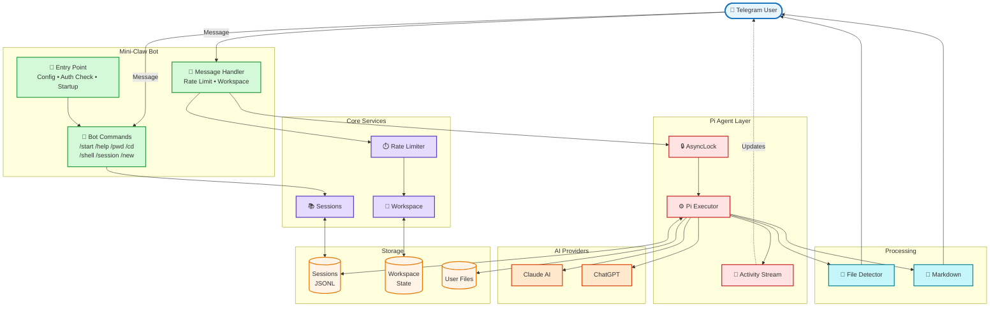
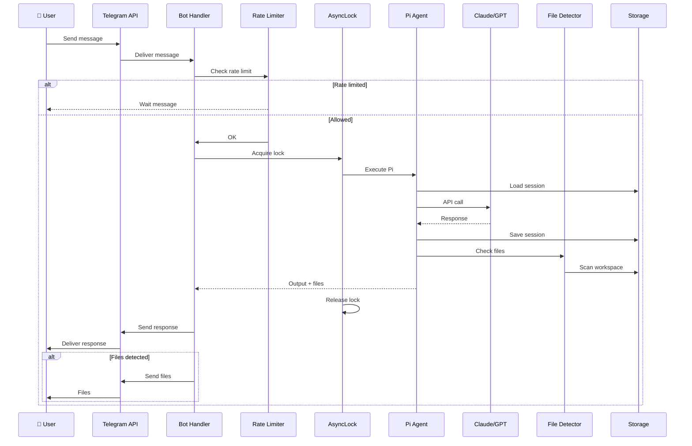
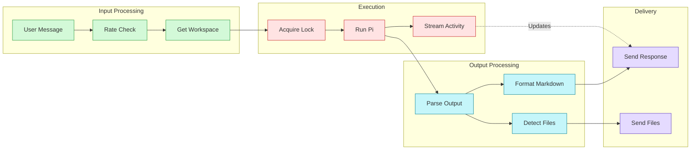

# Mini-Claw Architecture Diagram (Simplified for PNG Export)

## System Architecture



## Message Flow Diagram



## Component Interaction



## To Generate PNG:

### Option 1: Online (Mermaid Live Editor)
1. Visit https://mermaid.live/
2. Copy any diagram above
3. Click "PNG" or "SVG" to download

### Option 2: CLI (mermaid-cli)
```bash
npm install -g @mermaid-js/mermaid-cli
mmdc -i docs/architecture-simple.md -o docs/architecture.png
```

### Option 3: VS Code Extension
1. Install "Markdown Preview Mermaid Support"
2. Open this file in VS Code
3. Right-click diagram → "Export as PNG"
